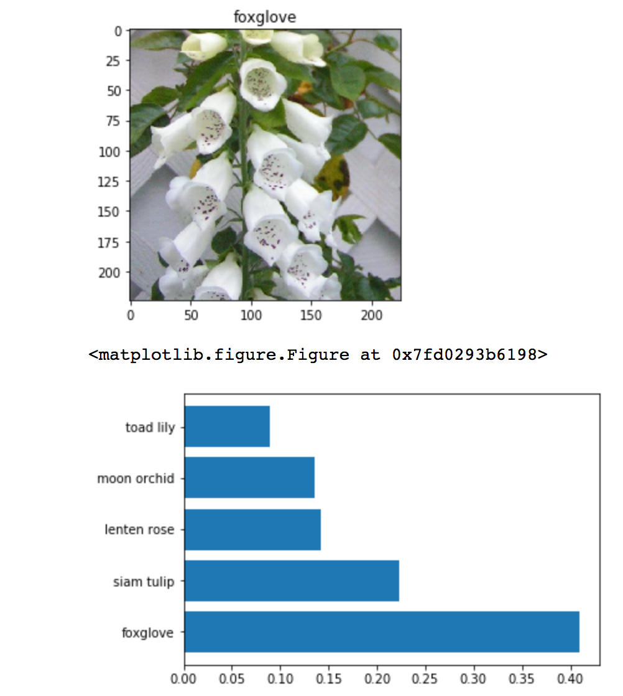

# Image Classification using Neural Networks

> Udacity AI Programming with Python Nanodegree Final Project

This application uses transfer learning from Convolutional Neural Networks (CNN) VGG and AlexNet that were trained on ImageNet. The CNNs are used as a fixed feature extractor to feed image features into a custom Linear Classifier that can be used to train any set of labeled images.

